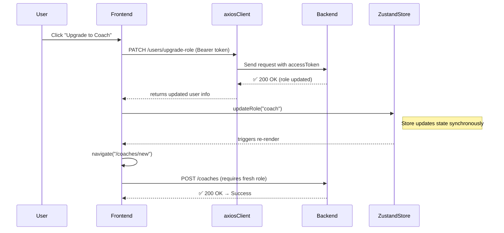

# 🧠 React–Axios–Zustand Debugging Report: Coach Role Upgrade Flow

## Overview

A two-day deep debugging session revealing how React handles async state, axios interceptors, and eventual consistency between backend updates and frontend state.

---

## 🧭 Integration Flow Diagram

